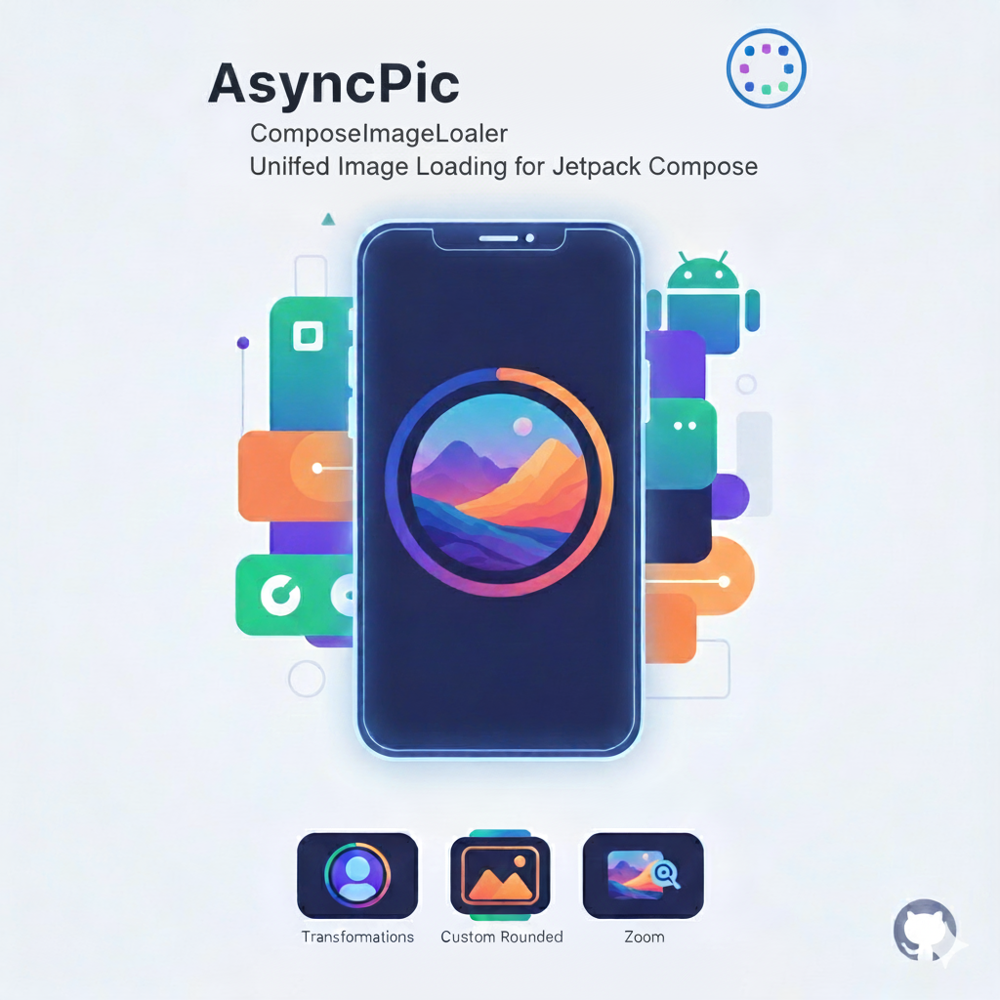
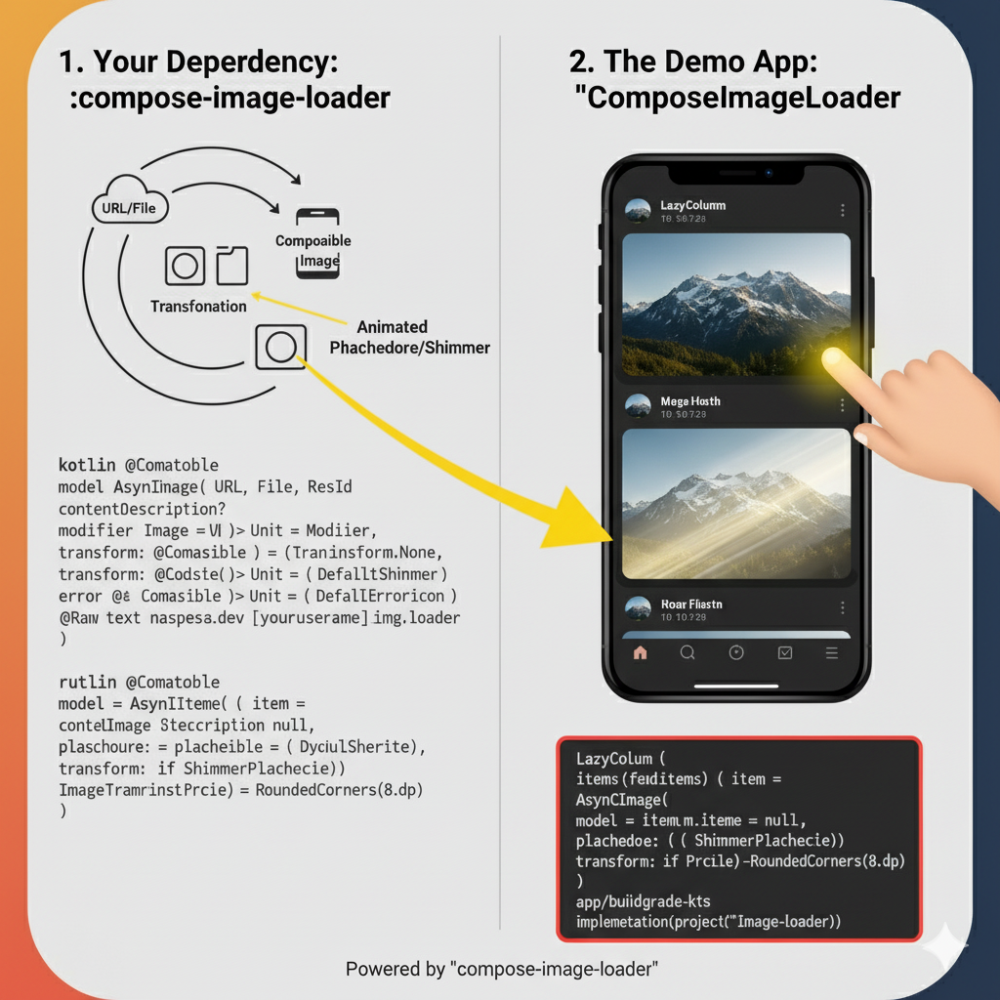

 <div align="center">
    
  
</div>

 # 📸 AsyncPic

A powerful and flexible image loading library for Jetpack Compose that simplifies advanced image handling with built-in transformations, loading states, and gesture support.

[](https://jitpack.io/#PatilParas05/AsyncPic)
[](https://opensource.org/licenses/MIT)
[](https://developer.android.com)
[](https://kotlinlang.org)

## ✨ Features

- **Unified API** - Single composable for all image loading needs
- **Built-in Transformations** - Circle, rounded corners, and custom shapes
- **Smart Loading States** - Automatic placeholder, loading, and error handling
- **Multiple Sources** - Load from URLs, files, or resources
- **Gesture Support** - Built-in pinch-to-zoom and pan capabilities
- **Customizable UI** - Custom placeholders and error composables
- **Powered by Coil** - Leverages Coil's efficient image loading

## Installation

### Step 1: Add JitPack repository

Add JitPack to your project's `settings.gradle.kts`:

```kotlin
dependencyResolutionManagement {
    repositoriesMode.set(RepositoriesMode.FAIL_ON_PROJECT_REPOS)
    repositories {
        google()
        mavenCentral()
        maven { url = uri("https://jitpack.io") }
    }
}
```

### Step 2: Add the dependency

Add AsyncPic to your app's `build.gradle.kts`:

```kotlin
dependencies {
    implementation("com.github.PatilParas05:AsyncPic:1.0.0")
}
```

## Quick Start

### Basic Usage

```kotlin
AsyncImageLoader(
    data = ImageRequestData(
        url = "https://example.com/image.jpg",
        contentDescription = "Sample Image"
    ),
    modifier = Modifier.size(200.dp)
)
```

### With Transformations

```kotlin
// Circle transformation
AsyncImageLoader(
    data = ImageRequestData(
        url = imageUrl,
        contentDescription = "Profile Picture",
        transform = ImageTransformation.Circle
    ),
    modifier = Modifier.size(100.dp)
)

// Rounded corners
AsyncImageLoader(
    data = ImageRequestData(
        url = imageUrl,
        contentDescription = "Card Image",
        transform = ImageTransformation.RoundedCorners(16.dp)
    ),
    modifier = Modifier.fillMaxWidth()
)
```

### Custom Placeholder and Error Handling

```kotlin
AsyncImageLoader(
    data = ImageRequestData(
        url = imageUrl,
        contentDescription = "Product Image",
        placeholder = {
            Box(
                modifier = Modifier.fillMaxSize(),
                contentAlignment = Alignment.Center
            ) {
                CircularProgressIndicator()
            }
        },
        error = {
            Column(
                modifier = Modifier.fillMaxSize(),
                horizontalAlignment = Alignment.CenterHorizontally,
                verticalArrangement = Arrangement.Center
            ) {
                Icon(
                    imageVector = Icons.Default.BrokenImage,
                    contentDescription = "Error"
                )
                Text("Failed to load image")
            }
        }
    ),
    modifier = Modifier.size(300.dp)
)
```

### Load from Different Sources

```kotlin
// From URL
ImageRequestData(url = "https://example.com/image.jpg")

// From File
ImageRequestData(file = File("/path/to/image.jpg"))

// From Resource
ImageRequestData(resId = R.drawable.my_image)
```

### Zoomable Images

Add pinch-to-zoom and double-tap zoom functionality:

```kotlin
AsyncImageLoader(
    data = ImageRequestData(
        url = imageUrl,
        contentDescription = "Zoomable Image",
        transform = ImageTransformation.None
    ),
    modifier = Modifier
        .fillMaxSize()
        .zoomable(), // Enable zoom gestures
    contentScale = ContentScale.Fit
)
```

## 📖 API Reference

### AsyncImageLoader

The main composable for loading images.

```kotlin
@Composable
fun AsyncImageLoader(
    data: ImageRequestData,
    modifier: Modifier = Modifier,
    contentScale: ContentScale = ContentScale.Crop
)
```

**Parameters:**
- `data`: Image request configuration
- `modifier`: Modifier to apply to the image
- `contentScale`: How to scale the image content

### ImageRequestData

Configuration data class for image requests.

```kotlin
data class ImageRequestData(
    val url: String? = null,
    val file: File? = null,
    val resId: Int? = null,
    val contentDescription: String? = null,
    val transform: ImageTransformation = ImageTransformation.None,
    val placeholder: @Composable () -> Unit = { DefaultShimmer() },
    val error: @Composable () -> Unit = { DefaultErrorIcon() },
    val onRetry: (() -> Unit)? = null
)
```

### ImageTransformation

Available transformations for images:

```kotlin
sealed class ImageTransformation {
    object None : ImageTransformation()
    object Circle : ImageTransformation()
    data class RoundedCorners(val dp: Dp) : ImageTransformation()
}
```

### Modifier Extensions

#### zoomable()

Adds pinch-to-zoom, double-tap, and pan gesture support:

```kotlin
fun Modifier.zoomable(
    minScale: Float = 1f,
    maxScale: Float = 5f
): Modifier
```

**Features:**
- Pinch to zoom (1x to 5x)
- Double-tap to toggle zoom
- Pan when zoomed in
- Smooth animations

## 🧑‍💻 Advanced Usage

### Fullscreen Image Viewer

Create an interactive fullscreen viewer with zoom capabilities:

```kotlin
@Composable
fun ImageViewerDialog(
    imageUrl: String,
    onDismiss: () -> Unit
) {
    Dialog(
        onDismissRequest = onDismiss,
        properties = DialogProperties(usePlatformDefaultWidth = false)
    ) {
        Box(
            modifier = Modifier
                .fillMaxSize()
                .background(Color.Black)
        ) {
            AsyncImageLoader(
                data = ImageRequestData(
                    url = imageUrl,
                    contentDescription = "Fullscreen Image",
                    transform = ImageTransformation.None
                ),
                modifier = Modifier
                    .fillMaxSize()
                    .zoomable(),
                contentScale = ContentScale.Fit
            )
            
            IconButton(
                onClick = onDismiss,
                modifier = Modifier
                    .align(Alignment.TopEnd)
                    .padding(16.dp)
            ) {
                Icon(
                    imageVector = Icons.Default.Close,
                    contentDescription = "Close",
                    tint = Color.White
                )
            }
        }
    }
}
```

### Custom Animated Placeholder

```kotlin
@Composable
fun CustomAnimatedPlaceholder() {
    val infiniteTransition = rememberInfiniteTransition()
    val alpha by infiniteTransition.animateFloat(
        initialValue = 0.3f,
        targetValue = 0.9f,
        animationSpec = infiniteRepeatable(
            animation = tween(1000),
            repeatMode = RepeatMode.Reverse
        )
    )
    
    Box(
        modifier = Modifier
            .fillMaxSize()
            .background(
                Brush.radialGradient(
                    colors = listOf(
                        Color(0xFF8b5cf6).copy(alpha = alpha * 0.3f),
                        Color(0xFFec4899).copy(alpha = alpha * 0.2f)
                    )
                )
            ),
        contentAlignment = Alignment.Center
    ) {
        CircularProgressIndicator(color = Color.White.copy(alpha = alpha))
    }
}

// Usage
AsyncImageLoader(
    data = ImageRequestData(
        url = imageUrl,
        placeholder = { CustomAnimatedPlaceholder() }
    )
)
```

### Grid of Images

```kotlin
@Composable
fun ImageGrid(imageUrls: List<String>) {
    LazyVerticalGrid(
        columns = GridCells.Fixed(3),
        contentPadding = PaddingValues(8.dp),
        horizontalArrangement = Arrangement.spacedBy(8.dp),
        verticalArrangement = Arrangement.spacedBy(8.dp)
    ) {
        items(imageUrls) { url ->
            AsyncImageLoader(
                data = ImageRequestData(
                    url = url,
                    contentDescription = "Grid Image",
                    transform = ImageTransformation.RoundedCorners(8.dp)
                ),
                modifier = Modifier
                    .aspectRatio(1f)
                    .clickable { /* Handle click */ }
            )
        }
    }
}
```

## Sample App

The library includes a comprehensive showcase app demonstrating all features:

- Image transformations (Circle, Rounded Corners)
- Loading states with shimmer effects
- Custom animated placeholders
- Error handling
- Fullscreen viewer with zoom
- Search functionality
- Interactive UI elements

To run the sample app:

```bash
git clone https://github.com/PatilParas05/AsyncPic.git
cd AsyncPic
./gradlew :app:installDebug
```

## Dependencies

AsyncPic is built on top of:

- **Jetpack Compose** - Modern declarative UI toolkit
- **Coil 2.5.0** - Fast, lightweight image loading
- **Kotlin Coroutines** - Asynchronous programming

## Requirements

- **Min SDK**: 26 (Android 8.0)
- **Compile SDK**: 36
- **Kotlin**: 1.9+
- **Compose**: 1.5+

## Performance Tips

1. **Use appropriate ContentScale** - `ContentScale.Crop` for thumbnails, `ContentScale.Fit` for full images
2. **Apply transformations** - Use built-in transformations for better performance
3. **Specify explicit sizes** - Helps avoid unnecessary recomposition
4. **Leverage caching** - Coil automatically caches images for faster subsequent loads

## 🤝 Contributing

Contributions are welcome! Please feel free to submit a Pull Request.

1. Fork the repository
2. Create your feature branch (`git checkout -b feature/AmazingFeature`)
3. Commit your changes (`git commit -m 'Add some AmazingFeature'`)
4. Push to the branch (`git push origin feature/AmazingFeature`)
5. Open a Pull Request

### Development Setup

```bash
# Clone the repository
git clone https://github.com/PatilParas05/AsyncPic.git

# Open in Android Studio
# Build the project
./gradlew build

# Run tests
./gradlew test
```

## 📄 License

```
MIT License

Copyright (c) 2024 Paras Patil

Permission is hereby granted, free of charge, to any person obtaining a copy
of this software and associated documentation files (the "Software"), to deal
in the Software without restriction, including without limitation the rights
to use, copy, modify, merge, publish, distribute, sublicense, and/or sell
copies of the Software, and to permit persons to whom the Software is
furnished to do so, subject to the following conditions:

The above copyright notice and this permission notice shall be included in all
copies or substantial portions of the Software.

THE SOFTWARE IS PROVIDED "AS IS", WITHOUT WARRANTY OF ANY KIND, EXPRESS OR
IMPLIED, INCLUDING BUT NOT LIMITED TO THE WARRANTIES OF MERCHANTABILITY,
FITNESS FOR A PARTICULAR PURPOSE AND NONINFRINGEMENT. IN NO EVENT SHALL THE
AUTHORS OR COPYRIGHT HOLDERS BE LIABLE FOR ANY CLAIM, DAMAGES OR OTHER
LIABILITY, WHETHER IN AN ACTION OF CONTRACT, TORT OR OTHERWISE, ARISING FROM,
OUT OF OR IN CONNECTION WITH THE SOFTWARE OR THE USE OR OTHER DEALINGS IN THE
SOFTWARE.
```

## Author

**Paras Patil**

- GitHub: [@PatilParas05](https://github.com/PatilParas05)

## Acknowledgments

- Built with [Coil](https://coil-kt.github.io/coil/)
- Inspired by modern image loading libraries
- Sample images from [Unsplash](https://unsplash.com)
- Icons from [Material Icons](https://fonts.google.com/icons)

---

If you find AsyncPic helpful, please consider giving it a ⭐ on GitHub!

**Made with ❤️ for the Android Compose community**
